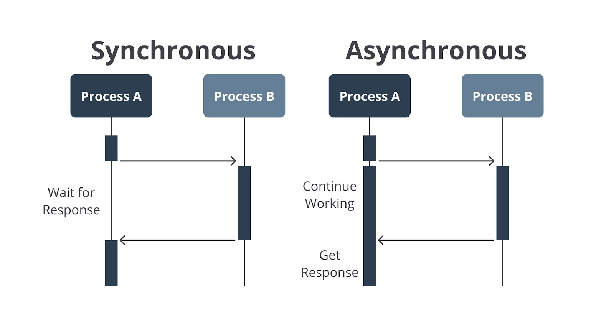

# Apa Itu Asynchronous Process

Dalam pengembangan aplikasi web atau Node.js, menangani proses yang berjalan secara asynchronous
menjadi topik yang cukup menantang. Lalu, apa sih proses asynchronous atau asinkron itu?

Dalam KBBI, asinkron berarti tidak dalam waktu atau kecepatan yang sama atau tidak serentak. Jika
dimaknai dalam konteks pemrograman, proses atau operasi asinkron adalah sebuah operasi yang
memungkinkan dijalankan oleh mesin dan kemudian dapat beralih fokus untuk menjalankan tugas-tugas (
operasi) berikutnya sembari menunggu operasi sebelumnya selesai. Apa alasan adanya proses seperti
ini?

Bayangkan Anda memiliki suatu tugas yang berpotensi mengonsumsi banyak waktu dan tidak seharusnya
selalu ditunggu agar tugas lain bisa berjalan.

Jika dicontohkan, ada banyak proses yang berjalan secara asinkron. Bahkan, tidak terhitung angkanya.
Katakanlah proses yang terjadi dalam kehidupan kita sebagai manusia. Disadari ataupun tidak, kita
sering mengalami proses ini. Menjaga kebersihan di lingkungan rumah menjadi salah satu contoh nyata.
Misalnya, kita dihadapkan kepada beberapa tugas berikut.

- Mencuci baju dengan mesin cuci.
- Mengelap ruangan dapur.
- Menjalankan dishwasher untuk piring dan gelas kotor.
- Menyapu dan mengepel lantai.

Untuk mengerjakan tugas pertama, berapa waktu yang dibutuhkan oleh mesin cuci agar selesai? Apakah
10, 20, atau bahkan 50 menit? Berapa pun lama waktunya, mesin cuci dapat menyita waktu bagi kita.
Gambaran kita saat ini adalah tugas berikutnya tidak akan dimulai sebelum tugas sebelumnya selesai.
Namun, kenyataannya tidak!

Sebab tugas telah didelegasikan kepada mesin cuci dan tinggal menunggu, kita bisa mengerjakan tugas
kedua dalam waktu yang bersamaan. Begitu juga mirip dengan beberapa tugas berikutnya jika bisa
dikerjakan dalam satu waktu. Inilah yang disebut dengan proses asinkron.

Dengan konsep yang sama, pengembangan aplikasi web juga memanfaatkan operasi-operasi yang berjalan
secara asinkron. Mesin dapat menjalankan tugas lainnya sembari menunggu proses asinkron selesai.
Beberapa contoh operasinya seperti melakukan koneksi dengan jaringan (network request), menjalankan
kueri ke basis data (querying a database), melakukan baca-tulis berkas dalam file system, dan
operasi lainnya yang berpotensi mengonsumsi banyak waktu.

Jadi, apa kesimpulan dari proses asynchronous? Proses yang tidak melakukan blocking process terhadap
proses berikutnya karena tugas komputasi yang besar dan memakan banyak waktu. Lawan dari proses
tersebut adalah synchronous. Jika synchronous process adalah proses yang dijalankan secara
berurutan, mulai dari awal sampai akhir, asynchronous process adalah proses yang dapat dieksekusi
secara paralel.

Perhatikan ilustrasi berikut untuk melihat perbedaan antara synchronous dan asynchronous process.

Keren! Kali ini Anda sudah paham maksud dari asynchronous process. Pada beberapa materi ke depan,
kita akan belajar metode penanganan asynchronous process dalam JavaScript, mulai dari cara lama
hingga terkini.

Oke, sudahkah Anda siap? Mari kita mulai.

