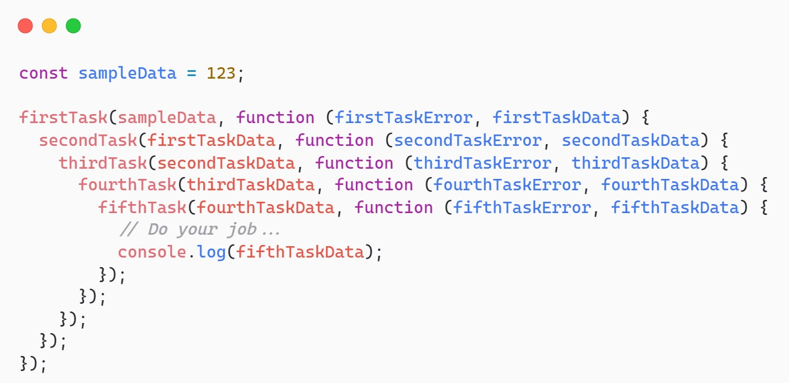
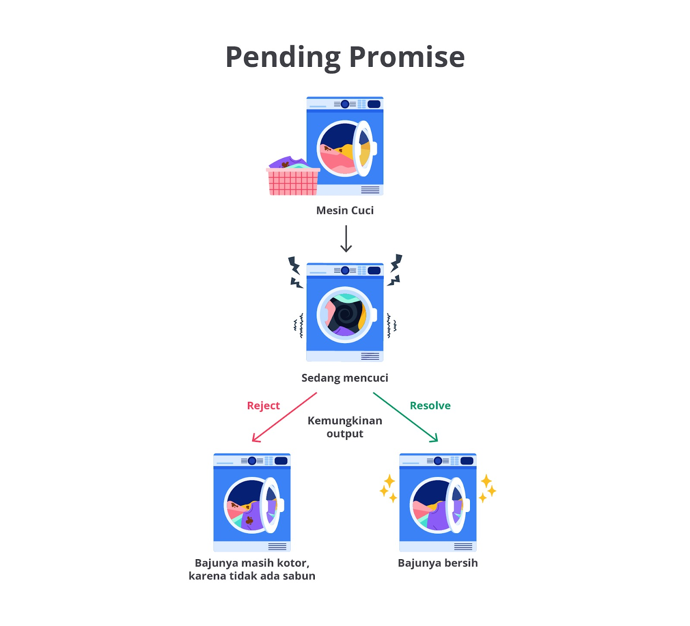

Apa Itu Promise
Callback bukanlah satu-satunya cara penanganan proses asynchronous sebenarnya. Callback dapat menjalankan tugasnya dengan sangat baik. Namun, ada hal yang menyebabkan callback ini mencapai taraf tidak efektif. Bayangkan saja bila suatu tugas bergantung terhadap hasil dua atau lebih tugas asynchronous seperti studi kasus kita sebelumnya.

```js
makeCoffee(order, (makeCoffeeError, makeCoffeeData) => {
  if (makeCoffeeError) {
    console.log(makeCoffeeError);
    return;
  }

  sendCoffee(makeCoffeeData, (sendCoffeeError, sendCoffeeData) => {
    if (sendCoffeeError) {
      console.log(sendCoffeeError);
      return;
    }

    console.log(`Pramusaji memberikan ${sendCoffeeData} pesanan.`);
    console.log(`Saya mendapatkan ${sendCoffeeData} dan menghabiskannya.`);
  });
});
```

Tentunya kode di atas baik-baik saja. Katakanlah aktivitas meminum kopi ditandai dengan munculnya teks “Saya mendapatkan Kopi Espresso dan menghabiskannya”. Hal yang menjadi permasalahan adalah bagaimana jika proses minum kopi bergantung pada lebih dari dua, tiga, empat, atau lebih async process? Dalam konteks penulisan kode, itu akan makin menjorok ke dalam dan lebih sulit dipahami. Inilah efek dari pemanfaatan callback dan akan merujuk pada istilah callback hell.



Teknik terkini yang disajikan oleh JavaScript adalah Promise. Promise adalah sebuah objek khusus yang akan menentukan keberhasilan atau kegagalan dari proses asynchronous. Secara bahasa, Promise memiliki arti janji dan memang konsep yang dianut sangat mirip dengan makna tersebut.

Promise bekerja dengan tiga buah state atau kondisi.

- Pending: kondisi awal sebuah proses berjalan. Belum ada hasil yang diharapkan.
- Fulfilled: kondisi keberhasilan proses dan akan mengembalikan nilai positif. Misalnya mengembalikan isi berkas jika pembacaannya sukses.
- Rejected: operasi terjadi kegagalan dan membawa alasan atau data mengenai masalah ini. Biasanya, data kegagalan berupa instance dari class Error.

Dari ketiga kondisi Promise, ini mirip dengan kehidupan nyata. Pending menandakan sebuah janji sedang berproses untuk menuju state diselesaikan, baik itu fulfilled maupun rejected. Masuk ke kategori fulfilled untuk menandakan sebuah janji ditepati dan memberikan hasil kesuksesannya serta rejected untuk menandakan sebuah janji teringkari dan memberikan alasannya.



Mari kita ambil contoh tugas mencuci pakaian pada mesin cuci. Bayangkan saja mesin cuci punya tiga buah state.

- Pending: mesin cuci sedang berjalan dan belum bisa memberikan hasil apa pun.
- Fulfilled: mesin cuci menyelesaikan tugasnya dengan baik dan pakaian sudah dibersihkan.
- Rejected: mesin cuci mengalami kegagalan ketika berproses dan mengembalikan baju kotor beserta alasannya. Misalnya belum diberi sabun, air tiba-tiba tidak mengalir, dan berbagai faktor lainnya.

Promise pada akhirnya akan diselesaikan. Tugas kita sebagai developer adalah memberikan kode logika untuk menangani jika proses masuk ke fulfilled atau terjadi kesalahan (rejected).

Sip! Anda sudah paham mengenai konsep Promise dalam JavaScript dan berikutnya kita akan praktik!
