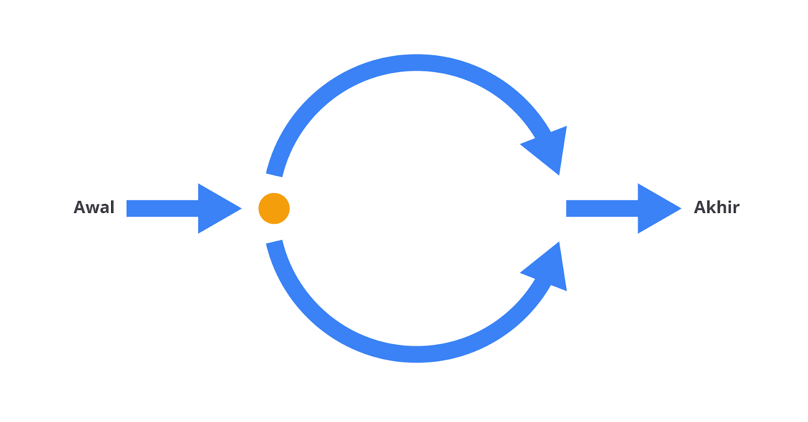
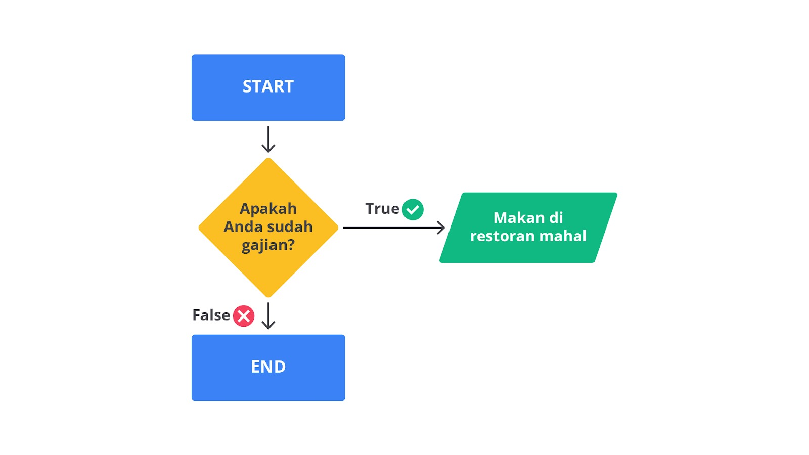
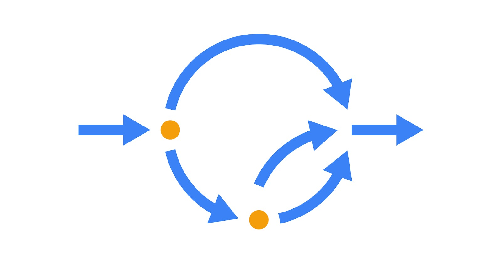

# Conditional

Kode akan dieksekusi tergantung dari kondisi yang ditetapkan dan ini disebut dengan conditional flow.

Conditional Flow di JavaScript terdiri dari If Statement dan Switch Case. Yuk, kita simak pembahasannya.

## If Statement

JavaScript menyediakan sintaksis yang lebih ringkas yaitu menggunakan ternary operator. Ternary operator atau nama lainnya conditional operator direpresentasikan menggunakan tanda tanya (?).

Ternary operator membutuhkan tiga operan dengan urutan seperti berikut:

Kondisi yang ingin diperiksa ditulis sebelum tanda tanya (?)
Ekspresi yang dieksekusi jika kondisinya benar.
Ekspresi yang dieksekusi jika kondisi salah.

## Switch Case

Switch statement adalah control flow statement yang mengevaluasi expression terhadap beberapa kasus. Switch dapat menggantikan beberapa pengecekan kondisi yang dilakukan oleh if. Selain itu, menggunakan switch membuat kode menjadi lebih readable dan ringkas. Inilah struktur dari switch case statement.
