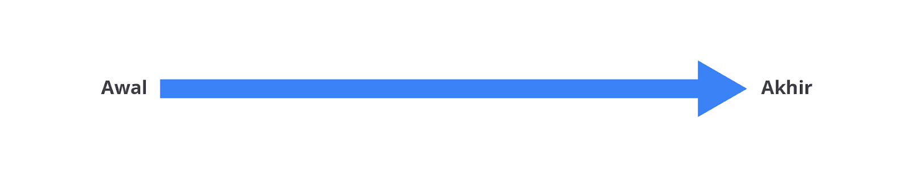
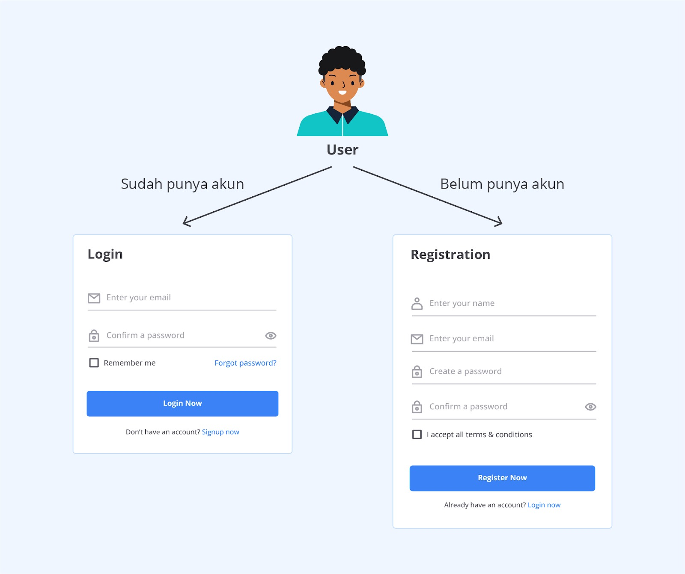
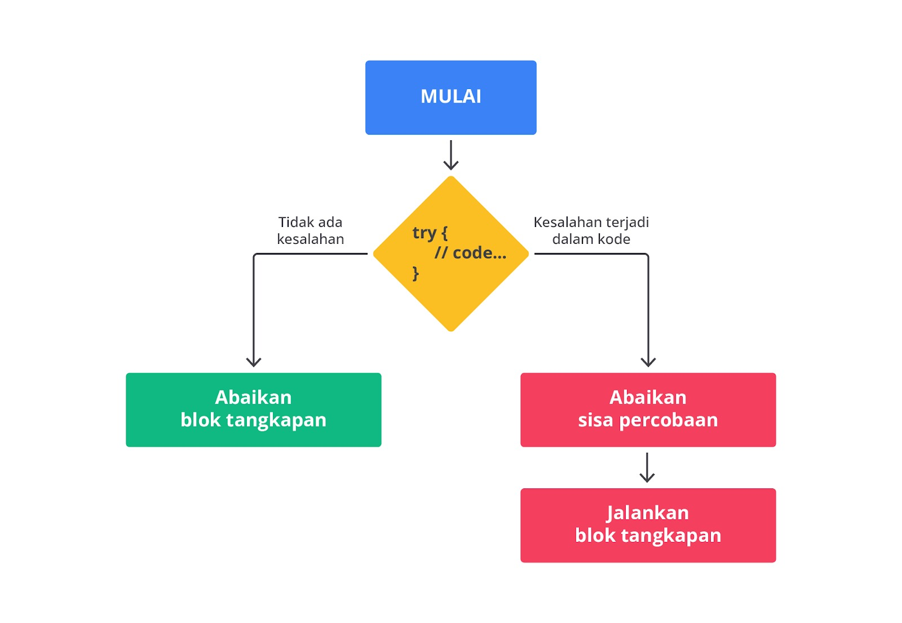

# Flow Controls

Sebuah program JavaScript akan memiliki lebih dari satu expression dan statement. Apa yang terjadi jika program memilki lebih dari satu expression dan statement? jawabannya adalah program akan menjalankan statement berurutan dari atas ke bawah (secara sekuansial).

```bash
const number = 100;
console.log (number);
#output : 100
```

Komputer akan menjalankan baris pertama yaitu menginisiasi variabel number. Kemudian, komputer akan menjalankan baris selanjutnya untuk mencetak nilai variabel number di console atau terminal. Jika kita gambarkan alurnya, akan menjadi seperti berikut ini.



adi, flow control adalah urutan bagaimana expression dan statement dijalankan oleh komputer berdasarkan kondisi dan logika tertentu (yang akan kita bahas di modul ini). Flow control memungkinkan programmer untuk membuat program yang dinamis, mengeksekusi perintah yang berulang dan menangani berbagai macam kondisi berdasarkan input dari pengguna. Tak peduli Anda membangun aplikasi web sederhana, aplikasi mobile atau aplikasi kompleks, flow control penting untuk dipelajari karena ia merupakan fundamental dari bahasa pemrograman.

Mari kita lihat contoh di aplikasi nyata yang Anda gunakan. Misalnya, Anda ingin memesan makanan secara daring melalui aplikasi mobile. Anda akan mengunduhnya jika belum memiliki aplikasi tersebut dan membuka aplikasi jika sudah memilikinya. Ketika Anda pertama kali masuk ke aplikasi, Anda akan dihadapkan antara dua pilihan, daftar (jika belum punya akun) atau masuk (jika sudah punya akun) ke aplikasi tersebut. Anda akan memilih salah satu pilihan tersebut. Di balik layar, aplikasi akan mengeksekusi kode program berdasarkan pilihan Anda. Jika Anda memilih daftar, aplikasi akan mengeksekusi kode yang memproses daftar akun. Hal ini disebut dengan conditional flow yang akan kita bahas setelah ini, ya!



Secara umum, bahasa pemrograman (khususnya JavaScript) memiliki flow control yang terdiri dari: conditional, looping, dan error handling. Kita akan bahas satu per satu mulai dari conditional hingga error handling secara tuntas di materi selanjutnya. Staylearning, ya!

# Error Handling

## Try-catch


