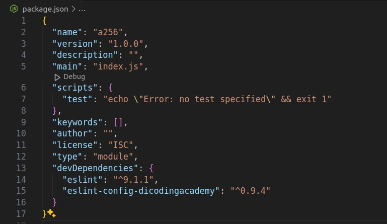

# Menggunakan Modularisasi ESM di Node.js

Karena ESModule adalah barang baru di dunia persilatan Node.js, kita perlu menambahkan konfigurasi dalam project Node.js. Kalau Anda mengikuti latihan di modul ini pada lokal komputer, Anda akan mengalami error ketika menggunakan import dan export. Mungkin beberapa dari Anda sudah menyadari akan hal ini dan telah mencari solusi error dengan berselancar di internet.

Sebenarnya, kita hanya membutuhkan konfigurasi sederhana. Berikut cara yang dapat kita terapkan jika ingin menggunakan ES Modul di Node.js.

## Mengubah ekstensi berkas

Cara pertama yaitu mengubah ekstensi berkas dari .js menjadi mjs. Dengan mengubah format ini, kita memberitahu ke Node.js bahwa kita ingin menggunakan ESModule. Cara ini terbilang sangat sederhana. Namun, bagaimana jika berkas project Anda sangat banyak? Tidak mungkin Anda mengubahnya satu per satu karena pasti memakan waktu cukup lama dan tidak efisien.

## Menambahkan konfigurasi di package.json

Cara berikut ini akan menyelesaikan masalah yang ada pada cara sebelumnya yaitu dengan menambahkan konfigurasi pada level package. Dengan menambahkan konfigurasi pada level package, kita tidak perlu lagi untuk mengganti ekstensi berkas menjadi .mjs dan cara inilah yang kami lakukan sepanjang modul ini.

1. Buka berkas package.json atau jika belum memilikinya, Anda bisa membuatnya terlebih dahulu (dengan menggunakan perintah npm init -y)
2. Setelah itu, tambahkan baris kode berikut ini

```bash
"type": "module"
```

Sehingga package.json akan tampak seperti gambar di bawah ini.



Dua cara ini dapat membuat ESM bisa digunakan di Node.js. Anda bebas memilih cara mana pun sesuai kebutuhan di dalam project.

# Menggunakan Modularisasi ESM di Browser

ESModule tak hanya dapat digunakan pada Node.js, tetapi juga di browser. Hal ini merupakan kabar gembira bagi Web Developer, khususnya Front-End Developer yang banyak berkecimpung di browser. Penasaran bagaimana caranya?

Caranya adalah dengan menambahkan type pada saat memanggil tag script seperti contoh berikut ini.

```bash
<script src="./esmodule.js" type="module">
```

Dengan begitu, Anda dapat memuat berkas JavaScript sebagai ESModule pada berkas HTML dan dijalankan di browser. Perlu diingat bahwa tidak semua browser mendukung ESModule sehingga untuk menangani hal itu, tambahkan kode berikut ini.

```bash
<script nomodule src="fallback.js"></script>
```

Atribut nomodule akan memberitahu browser untuk memuat berkas fallback.js jika tidak mendukung ESModule.

Selain menulis JavaScript pada berkas terpisah dari HTML, Anda juga dapat menambahkan JavaScript dengan ESModule secara inline.

```bash
<script type="module">
  import App from "./app.js";
  console.log(App);
</script>
```

Anda sudah mengetahui manfaat membagi kode menjadi bagian kecil dengan module dan cara untuk membaginya. Semoga dengan menguasai modularisasi, Anda dapat menyederhanakan struktur kompleks di aplikasi menjadi lebih ringkas dan sederhana.
