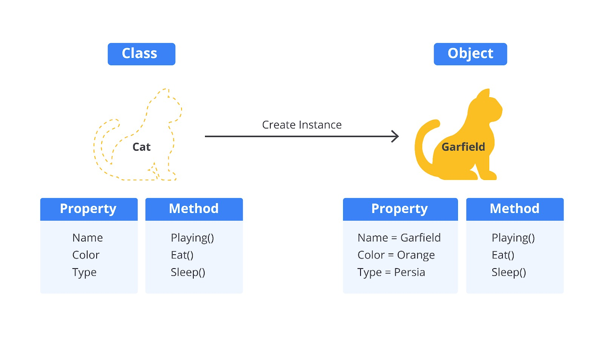

# Paradigma Berbasis Objek

Sesuai dengan namanya, di paradigma ini kita akan banyak berhubungan dengan objek. Object-oriented programming (OOP) adalah paradigma pemrograman yang memiliki pendekatan berbasis object. Object akan berinteraksi satu sama lain untuk menyelesaikan tugas sehingga membentuk keseluruhan program. Selain itu, object merupakan representasi dari entitas.

Object terdiri dari atribut informasi (property) dan perilaku (method). Property adalah informasi tentang objek tersebut seperti nama, warna, dan jenis, sedangkan method adalah aksi atau perilaku yang dapat dilakukan oleh objek seperti berjalan, berlari, dan terbang. Kita ambil contoh pada kehidupan sehari-hari, misalnya entitas kucing direpresentasikan menjadi object kucing dengan memiliki properti dan atribut. Property pada kucing adalah warna, jenis ras, nama, dan umur. Method pada kucing adalah berlari, tidur, makan, dan mencakar.

Misalkan, Anda memiliki dua ekor kucing dengan nama Ziggy dan Garfield. Untuk setiap kucing, kita perlu untuk menentukan nama, warna, berat badan, dan perilakunya.

Kucing pertama, kita mendefinisikan namanya adalah Ziggy, warnanya hitam putih, berat badannya 3 kg, dan perilakunya adalah suka tidur. Kemudian, kita melakukan hal yang sama untuk kucing kedua, Garfield. Kita mendefinisikan namanya Garfield, warnanya oranye, berat badannya 2 kg, dan perilakunya adalah suka bermain. Setiap memiliki kucing baru, kita akan melakukan hal ini secara berulang.

Jika memiliki lima kucing, bayangkan betapa repotnya kita untuk mendefinisikan setiap ciri-cirinya. Begitu pula dengan pemrograman, bila kita memiliki 5 objek yang berbeda, tentunya akan memakan waktu yang lama untuk mendefinisikan properti dan methodnya satu per satu. Lalu, apa solusinya? Solusinya adalah menggunakan object dan class. Selama menggunakan paradigma OOP, kita akan sering berhubungan dengan object dan class.

Object adalah bentuk nyata dari suatu entitas, sedangkan class adalah cetak biru (blueprint), cetakan atau template yang dapat kita gunakan berulang kali untuk membuat object. Object dan class mempermudah ketika ingin membuat entitas yang kompleks dengan cepat dan efektif. Anda perlu untuk mencermati kedua hal ini agar bisa menguasai paradigma OOP.



Karena object dan class memiliki peran sangat penting di paradigma OOP, kita akan membahas cara membuatnya dengan dua cara di bawah ini.

# Constructor function

JavaScript bukanlah bahasa pemrograman berbasis class sehingga JavaScript tidak mengenal class. Meskipun tidak mengenal class, prinsip OOP tetap dapat diterapkan. Constructor function adalah cara yang digunakan untuk membuat object dan class sebelum adanya ES6. Cara membuat object dan class menggunakan constructor function dapat dilihat pada contoh berikut.

```bash
function Person(name, age) {
  this.name = name;
  this.age = age;
}

Person.prototype.eat = function() {
  console.log(`${this.name} is eating`);
}
```

Kode di atas merupakan contoh membuat blueprint dari entitas person. JavaScript bukan bahasa pemrograman berbasis class, melainkan bahasa pemrograman berbasis prototype (prototype-based language). Oleh karena itu, Anda melihat penggunaan prototype pada contoh kode di atas.

Prototype adalah salah satu konsep fundamental dalam JavaScript yang memungkinkan pewarisan sifat dan method antar object (akan dibahas nanti). Semua object di JavaScript memiliki properti tersembunyi bernama [[Prototype]] yang mengarah ke object prototype lain atau null.

```bash
Catatan
Properti dari sebuah object yang merujuk ke prototype-nya tidak disebut prototype. Namanya tidak standar antar JavaScript runtime, tetapi dalam praktiknya semua browser menggunakan nama __proto__.
Cara standar untuk mengakses prototype sebuah object adalah dengan metode Object.getPrototypeOf().
```

Kemudian, untuk membuat object person dengan constructor function dapat dilakukan seperti berikut.

```bash
const person1 = new Person('Alice', 30);
const person2 = new Person('Bob', 25);

console.log(person1.name); // Output: Alice
console.log(person2.name); // Output: Bob

person1.eat();
person2.eat();
```

Jangan heran, kalau kita dapat membuat sebuah object dari sebuah function di JavaScript, itu merupakan kemampuan dari function JavaScript. Perlu diingat bahwa function tersebut berbeda dengan function biasa karena ia adalah constructor function. Selain itu, kita tidak dapat membuat object dari arrow function karena ia tidak dapat dipanggil dengan keyword new.

```bash
Catatan
Biasanya penamaan constructor function ditulis dengan awalan huruf besar untuk membedakan dengan penamaan fungsi biasa.
```

# ES6 Class

Cara yang lebih modern untuk membuat object dan class adalah menggunakan ES6. ES6 sudah mendukung class sehingga membuat JavaScript mirip dengan bahasa lain yang berbasis class seperti Java, C++, dan C#. Berikut cara untuk membuat class.

```bash
class Person {
  constructor(name, age) {
    this.name = name;
    this.age = age;
  }

  eat() {
    console.log(`${this.name} is eating`);
  }
}

// Membuat instance dari Person
const person1 = new Person('Alice', 30);
const person2 = new Person('Bob', 25);

console.log(person1.name); // Output: Alice
console.log(person2.name); // Output: Bob

person1.eat(); // Output: Alice is eating
person2.eat(); // Output: Bob is eating
```

Dengan adanya ES6, penerapan salah satu pilar OOP akan lebih mudah terutama bagi Anda yang merupakan programmer Java, C++, dan C#. Selain itu, ES6 Class juga memungkinkan kita untuk menggunakan method super untuk memanggil constructor SuperClass (akan kita bahas di materi berikutnya).

Walaupun di JavaScript sudah mendukung class, hal itu tidak mengubah JavaScript menjadi bahasa pemrograman berbasis class. Faktanya, sintaks class di JavaScript hanyalah syntactic sugar atau cara alternatif dalam mendefinisikan constructor function. Untuk membuktikan hal tersebut, kita bisa mengecek tipe class melalui operator typeof.

```bash
class Person {};
console.log(typeof Person); // Output: function
```

Dapat terlihat bahwa outputnya adalah function. Sejauh ini, Anda sudah mengetahui cara membuat object dan class. Pemahaman ini akan sangat membantu Anda untuk memahami OOP lebih lanjut. Ke depannya, kami hanya fokus menggunakan sintaks class daripada menggunakan constructor function. Materi selanjutnya akan lebih menarik karena membahas konsep OOP. Yuk, lanjut ke materi selanjutnya!
