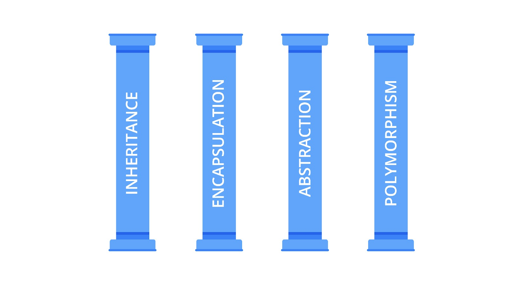

# Tonggak Utama dari OOP

OOP sangat cocok digunakan pada program yang kompleks karena dapat mengelompokkan kode menjadi object dan class. Selain itu, kode yang kompleks akan menjadi lebih bersih dan ringkas karena bisa digunakan kembali melalui konsep inheritance (class dan inheritance akan dibahas lebih detail di materi berikutnya). OOP memiliki empat pilar yang membentuknya yaitu encapsulation, inheritance, polymorphism, dan abstraction.

Empat prinsip ini menjadi panduan dalam menulis program untuk memastikan bahwa kompleksitas selama pengembangan perangkat lunak berkurang. Di bahasa pemrograman yang kental dengan praktik OOP seperti Java, keempat konsep didukung dan dapat diterapkan dengan baik. Namun, beberapa praktik yang ada di JavaScript, seperti abstraction, tidak dapat diterapkan secara maksimal karena keterbatasan fitur yang tersedia. JavaScript sendiri sampai saat ini belum memiliki cara untuk membuat abstract class secara standar yang dibutuhkan dalam menerapkan konsep abstraction.

Untuk itu, di modul ini, kita akan membahas konsep inheritance, encapsulation, dan polymorphism di JavaScript sebagai pilar utama di dalam paradigma OOP.

Yuk, lanjut ke materi selanjutnya untuk mengupasnya lebih dalam!
