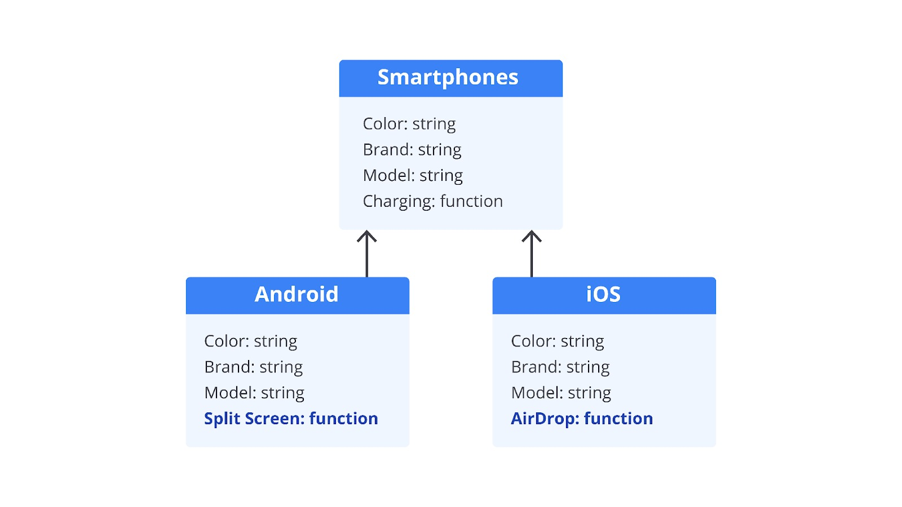
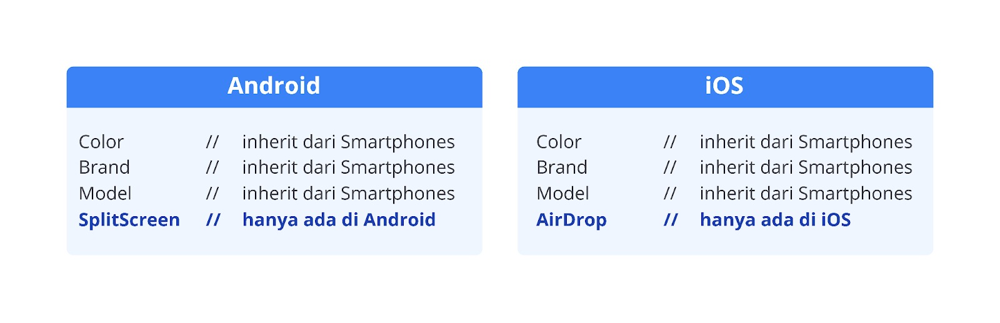

# I nheritance

Pilar yang akan kita bahas pertama adalah inheritance. Inheritance jika diterjemahkan ke dalam bahasa Indonesia artinya adalah pewarisan. Sesuai dengan namanya, kita bisa mewariskan harta property dan method dari sebuah class ke class lain. Umumnya, properti dan method yang diwariskan berasal dari class (induk) dan digunakan oleh class baru (anak). Sama halnya di kehidupan sehari-hari, sedikit banyaknya sebagai anak, kita memperoleh sifat dan perilaku dari orang tua.

Di OOP, inheritance memungkinkan class untuk mewarisi property dan method yang dimilikinya sehingga membantu mengurangi penulisan kode secara berulang (mengurangi redundancy kode). Misalnya, ketika kita membuat sebuah class dengan property dan method, keduanya dapat digunakan kembali oleh class lainnya melalui inheritance. Berikut adalah contohnya.

```bash
class SuperClass { }

class SubClass extends SuperClass { }
```

Istilah SuperClass dan SubClass akan sering kita dengar ketika bahas inheritance di OOP. Class yang mewariskan property dan method-nya disebut dengan SuperClass, Induk, Base, atau Parent Class. Class yang mewarisi property dan method dari class lain disebut dengan SubClass dan Children Class (Anak).

Misalnya, Anda memiliki smartphones dengan jenis Android dan iOS, setiap smartphones tersebut pasti memiliki property color, brand, model, dan method-nya adalah charging. Dengan paradigma OOP, property dan method yang memiliki kesamaan bisa kita abstraksikan menjadi sebuah class baru bernama Smartphones. Kemudian kita bisa membuat dua class baru, yaitu Android dan iOS.



Android dan iOS akan mewariskan property dan method dari class Smartphones seperti yang ada pada gambar di atas. Dengan begitu, class Android dan iOS akan memiliki property color, brand, model dan method charging. Selain itu, di masing-masing class kita dapat menambahkan property yang hanya ada pada dirinya. Misalkan, class Android memungkinkan untuk memiliki method split screen, sedangkan class iOS memungkinkan untuk memiliki method AirDrop.



Jika contoh di atas kita terapkan pada kode JavaScript, kodenya akan menjadi seperti berikut ini.

```bash
class SmartPhones {
  constructor(color, brand, model) {
    this.color = color;
    this.brand = brand;
    this.model = model;
  }

  charging() {
    console.log(`Charging ${this.model}`);
  }
}

class iOS extends SmartPhones {
  airDrop() {
    console.log('iOS have a behavior AirDrop');
  }
}

class Android extends SmartPhones {
  splitScreen() {
    console.log('Android have a Split Screen');
  }
}

const ios = new iOS('black', 'A', '12 Pro Max');
const android = new Android('white', 'B', 'Galaxy S21');

ios.charging(); // Output: Charging 12 Pro Max
ios.airDrop(); // Output: iOS have a behavior AirDrop

android.charging(); // Output: Charging Galaxy S21
android.splitScreen(); // Output: Android have a Split Screen
```

Di implementasi kode, SubClass (Android, iOS) hanya mendefinisikan method yang hanya ada pada dirinya. Selain itu, kita tetap dapat mengakses property dan method yang ada pada SuperClass (color, brand, model, charging) sehingga mengurangi penulisan kode yang berulang.

Ternyata, mengimplementasikan pewarisan di JavaScript dengan ES6 Class sangat mudah, ya. Masih ingatkah Anda bahwa sebelum adanya ES6 Class, untuk membuat class di JavaScript menggunakan constructor function. Sekarang, kita akan kilas balik ke masa sebelum adanya ES6. Kita akan mencoba merasakan penderitaan orang terdahulu dalam mengimplementasikan pewarisan sebelum adanya ES6 Class.

Tanpa menggunakan ES6 Class, pewarisan akan menggunakan teknik prototype inheritance seperti berikut ini.

```bash
function SmartPhones(color, brand, model) {
  this.color = color;
  this.brand = brand;
  this.model = model;
}

SmartPhones.prototype.charging = function() {
  console.log(`Charging ${this.model}`);
};

function iOS(color, brand, model) {
  SmartPhones.call(this, color, brand, model);
}

iOS.prototype = Object.create(SmartPhones.prototype);
iOS.prototype.constructor = iOS;

iOS.prototype.airDrop = function() {
  console.log('iOS have a behavior AirDrop');
};

function Android(color, brand, model) {
  SmartPhones.call(this, color, brand, model);
}

Android.prototype = Object.create(SmartPhones.prototype);
Android.prototype.constructor = Android;

Android.prototype.splitScreen = function() {
  console.log('Android have a Split Screen');
};

const ios = new iOS('black', 'A', '12 Pro Max');
const android = new Android('white', 'B', 'Galaxy S21');

ios.charging(); // Output: Charging 12 Pro Max
ios.airDrop(); // Output: iOS have a behavior AirDrop

android.charging(); // Output: Charging Galaxy S21
android.splitScreen(); // Output: Android have a Split Screen
```

Bagaimana menurut Anda? Apakah penggunaan constructor function dalam pewarisan lebih sulit untuk dibaca atau lebih mudah? Asumsi kami, Anda menjawab lebih sulit untuk dibaca. Yap, memang lebih sulit untuk dibaca. Inilah alasan mengapa ES6 hadir untuk membuat kode lebih mudah dibaca dan dipahami. Namun, perlu dicatat bahwa kedua cara tersebut sama-sama menggunakan prototype inheritance.

Untuk mengetahui asal muasal dari sebuah class, Anda dapat menggunakan instanceof. Instanceof dapat digunakan untuk menguji apakah suatu object merupakan instance dari sebuah class atau constructor function tertentu. Nilai keluaran dari instanceof adalah boolean. Jika object tersebut merupakan instance dari kelas yang diuji, nilainya akan true. Jika tidak, nilainya akan false. Perhatikan contoh berikut ini.

```bash
class SmartPhones {
  constructor(color, brand, model) {
    this.color = color;
    this.brand = brand;
    this.model = model;
  }

  charging() {
    console.log(`Charging ${this.model}`);
  }
}

class iOS extends SmartPhones {
  airDrop() {
    console.log('iOS have a behavior AirDrop');
  }
}

class Android extends SmartPhones {
  splitScreen() {
    console.log('Android have a Split Screen');
  }
}

const ios = new iOS('black', 'A', '12 Pro Max');
const android = new Android('white', 'B', 'Galaxy S21');

console.log(ios instanceof SmartPhones); // Output: true
console.log(android instanceof SmartPhones); // Output: true
```

Berdasarkan contoh di atas, terbukti bahwa iOS dan Android adalah class yang terbuat dari constructor SmartPhones. Secara sederhana, iOS dan Android memiliki rantai prototype dengan SmartPhones.
