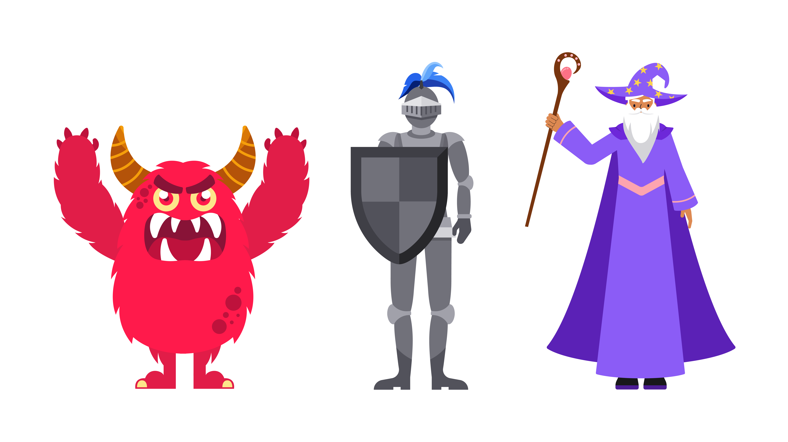
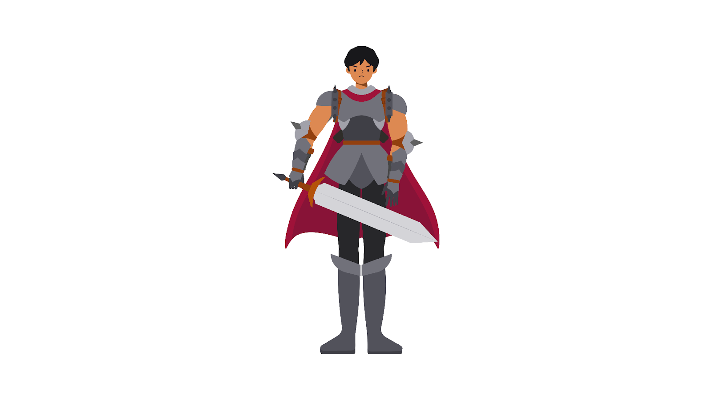
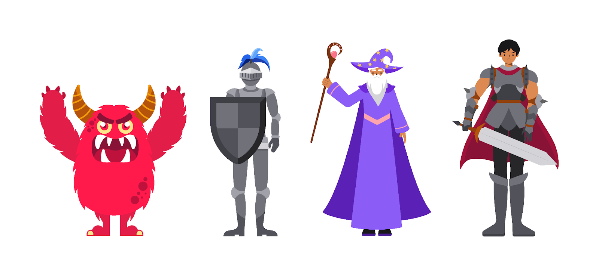

# Object Composition

Sebelumnya, Anda sudah menguasai pilar pewarisan di OOP, bahkan Anda sudah menguasai konsep overriding. Pewarisan memungkinkan kita untuk mengurangi menulis kode secara berulang (tidak efektif). Namun, apakah pewarisan mampu untuk memecahkan masalah kode yang kompleks? Apakah pewarisan hanya mampu untuk kasus sesederhana sebelumnya? Yuk, kita eksplorasi bersama.



Misalnya, Anda sedang mengembangkan sebuah video game. Video game tersebut memiliki banyak karakter seperti monster, wizard dan guardian. Setiap karakter memiliki kemampuan yang sama yaitu bergerak. Selain itu, setiap karakter memiliki kemampuan yang unik pada dirinya seperti menyerang, bertahan, dan mengeluarkan sihir. Jika skenario video game ini kita gambarkan dengan konsep OOP, karakter akan menjadi SuperClass, sedangkan monster, wizard, dan guardian akan menjadi SubClass seperti contoh berikut ini.

```bash
class Character {
  constructor(name, health, position) {
    this.name = name;
    this.health = health;
    this.position = position;
  }

  canMove() {
    console.log(`${this.name} moves to ${this.position}!`);
  }
}


class Monster extends Character {
  canAttack() {
    console.log(`${this.name} attacks with a weapon!`);
  }
}

class Guardian extends Character {
  canDefend() {
    console.log(`${this.name} defends with a shield!`);
  }
}

class Wizard extends Character {
  canCastSpell() {
    console.log(`${this.name} casts a magic spell!`);
  }
}
```

Oke, tidak ada yang salah dengan implementasi kode tersebut kan? Nah, timbul masalah ketika kita ingin menambahkan satu karakter lagi, misalnya karakter warrior. Warrior adalah karakter yang memiliki kekuatan super, ia bisa menyerang, bertahan, dan bergerak.



Bagaimana cara kita untuk membuat class Warrior? Anda mungkin menjawab dengan melakukan pewarisan dari SuperClass Character. Yup, hal itu benar karena memang itulah satu-satunya cara.

```bash
class Warrior extends Character {
  canAttack() {
    console.log(`${this.name} attacks with a weapon!`);
  }

  canDefend() {
    console.log(`${this.name} defends with a shield}!`);
  }
}
```

Namun, cara tersebut tidak efektif karena ketika kita mengubah implementasi salah satu method, kita perlu untuk mengubahnya di dua tempat. Katakanlah, kita mengubah method canAttack(), kita perlu untuk mengubahnya di SubClass Monster dan Warrior. Lantas, apa solusinya? Solusinya adalah mengubah pewarisan menjadi object composition.



## Kenali, Object Composition.

Object composition dapat menjadi solusi untuk masalah pewarisan yang kompleks seperti di kasus polymorphism. Jika sebelumnya, pewarisan menggunakan pendekatan peran atau identitas dalam menstrukturkan kode, yakni Monster, Wizard, Warrior, dan Guardian. Ketika menggunakan object composition, pendekatan yang digunakan adalah berbasis kemampuan, bukanlah peran atau identitas.

Kode distrukturkan berdasarkan kemampuan, apakah ia bisa menyerang, bertahan atau mengeluarkan sihir seperti berikut ini.

```bash
function canAttack(character) {
  return {
    attack: () => {
      console.log(`${character} attacks with a weapon!`);
    }
  }
}

function canDefend(character) {
  return {
    defend: () => {
      console.log(`${character} defends with a shield!`);
    }
  }
}

function canCastSpell(character) {
  return {
    castSpell: () => {
      console.log(`${character} casts a spell!`);
    }
  }
}
```

Karena struktur kode sudah dipecah berdasarkan kemampuan, bukan peran atau identitas, ke depannya ketika ada karakter baru yang memiliki kombinasi kemampuan, akan lebih mudah untuk membuatnya. Untuk membuat object, kita dapat membuat function sebagai object creator dan mengomposisikan kemampuan-kemampuan tersebut.

Di JavaScript, kita dapat mengomposisikan objek secara mudah dengan menggunakan method Object.assign(). Object.assign() adalah method statis untuk menyalin semua properti dari satu atau lebih object ke objek target. Object.assign() akan mengembalikan objek target yang dimodifikasi.

```bash
function createMonster(name) {
  const character = new Character(name, 100, 0);
  return Object.assign(character, canAttack(name));
}

function createGuardian(name) {
  const character = new Character(name, 100, 0);
  return Object.assign(character, canDefend(name));
}

function createWizard(name) {
  const character = new Character(name, 100, 0);
  return Object.assign(character, canCastSpell(name));
}

function createWarrior(name) {
  const character = new Character(name, 100, 0);
  return Object.assign(character, canAttack(character), canDefend(character));
}
```

Setelah membuat object creator, Buatlah object Monster, Warrior, Wizard, dan Guardian. Anda dapat melihat dan menjalankan kode lengkapnya di bawah ini.

```bash
class Character {
  constructor(name, health, position) {
    this.name = name;
    this.health = health;
    this.position = position;
  }

  canMove() {
    console.log(`${this.name} moves to another position!`);
  }
}

function canAttack(character) {
  return {
    attack: () => {
      console.log(`${character.name} attacks with a weapon!`);
    }
  };
}

function canDefend(character) {
  return {
    defend: () => {
      console.log(`${character.name} defends with a shield!`);
    }
  };
}

function canCastSpell(character) {
  return {
    castSpell: () => {
      console.log(`${character.name} casts a spell!`);
    }
  };
}

function createMonster(name) {
  const character = new Character(name, 100, 0);
  return Object.assign(character, canAttack(character));
}

function createGuardian(name) {
  const character = new Character(name, 100, 0);
  return Object.assign(character, canDefend(character));
}

function createWizard(name) {
  const character = new Character(name, 100, 0);
  return Object.assign(character, canCastSpell(character));
}

function createWarrior(name) {
  const character = new Character(name, 100, 0);
  return Object.assign(character, canAttack(character), canDefend(character));
}

const monster = createMonster('Monster');
monster.canMove();
monster.attack();

const guardian = createGuardian('Guardian');
guardian.canMove();
guardian.defend();

const wizard = createWizard('Wizard');
wizard.canMove();
wizard.castSpell();

const warrior = createWarrior('Warrior');
warrior.canMove();
warrior.attack();
warrior.defend();
```

Huft, tak terasa perjalanan kita sudah sejauh ini untuk menyelami dunia OOP. Anda sudah memahami cara memecahkan pewarisan yang rumit dengan object composition. Object composition dapat menjadi solusi untuk masalah pewarisan yang kompleks. Selain itu, dengan menggunakan object composition, maka pendekatan yang digunakan adalah berbasis kemampuan, bukanlah peran atau identitas.
