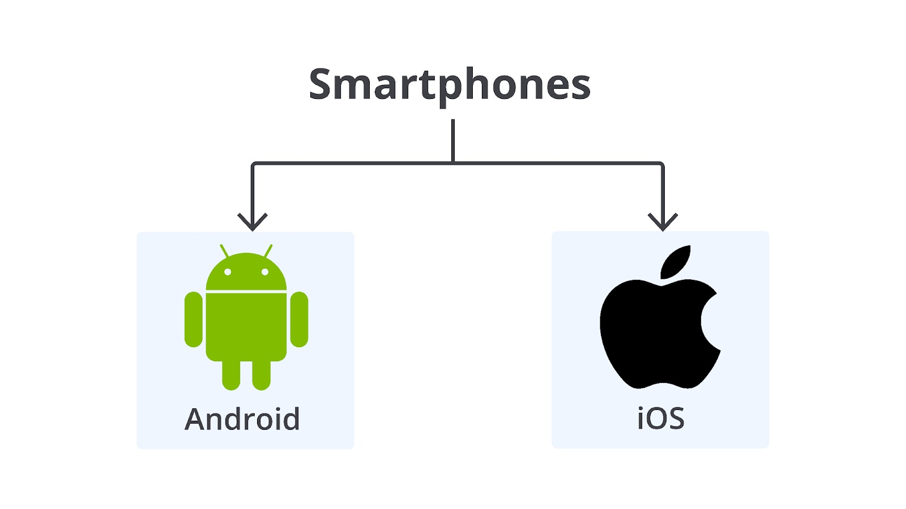

# Polymorphism

Seperti yang Anda ketahui sebelumnya bahwa kita dapat mewariskan property dan method ke class lainnya. Namun, apa yang terjadi jika SubClass ingin mengubah implementasi dari method yang diwariskan dari SuperClass? Layaknya kita sebagai anak, ingin mengubah suatu sifat atau perilaku dari orang tua yang kita mungkin tidak setuju atau butuhkan. Jangan khawatir, di OOP kita dapat mengubah implementasi method yang diturunkan dari SuperClass.

Bagaimana cara untuk mengubah implementasi yang diturunkan dari SuperClass? Caranya adalah menggunakan pilar utama lainnya dari OOP yaitu Polymorphism. Polymorphism berasal dari bahasa Yunani yang memiliki arti secara harfiah yaitu memiliki banyak bentuk. Polymorphism merupakan konsep di mana suatu entitas menjadi SuperClass untuk mewariskan property atau method ke SubClass.

Polymorphism berhubungan erat dengan pewarisan. Sebelumnya kita memiliki SuperClass Smartphones yang memiliki property color, brand, model dan method charging. Kemudian kita memiliki SubClass yang implementasinya berbeda tergantung dengan jenisnya seperti Android dan iOS.



Kini, bentuk implementasi dari Smartphones berbeda untuk setiap jenis. Inilah yang disebut dengan polymorphism. Lalu, bedanya apa dong dengan pewarisan? Bedanya terdapat pada implementasi method yang diubah. Untuk mengubah implementasi method tersebut, terdapat konsep yang disebut dengan overriding.

## Overriding

OOP memiliki konsep overriding yang sangat erat kaitannya dengan pewarisan. Overriding adalah cara kita untuk membuat implementasi yang berbeda di SubClass untuk method yang diturunkan dari SuperClass. Overriding dapat diterapkan untuk membuat method yang lebih spesifik di SubClass. Selain itu, overriding juga dapat diterapkan untuk menambah properti baru di SubClass. Overriding dapat diterapkan pada constructor maupun pada method.

## Overriding Constructor

Constructor adalah method khusus yang dipanggil ketika instance class dibuat. Misalnya, ketika membuat instance class dengan keyword new, constructor akan terpanggil.

```bash
const android = new Android(); // constructor di class Android akan dipanggil.
```

Jika kita telusuri kembali pada SuperClass Smartphones, terdapat constructor yang berisikan property color, brand, dan model.

```bash
class SmartPhones {
  constructor(color, brand, model) {
    this.color = color;
    this.brand = brand;
    this.model = model;
  }

  charging() {
    console.log(`Charging ${this.model}`);
  }
}
```

Bagaimana ketika kita butuh untuk menambahkan property baru pada SubClass Android atau iOS? Nah, kita dapat melakukan overriding constructor, caranya sesederhana mendefinisikan ulang constructor-nya seperti contoh berikut.

```bash
class SmartPhones {
  constructor(color, brand, model) {
    this.color = color;
    this.brand = brand;
    this.model = model;
  }

  charging() {
    console.log(`Charging ${this.model}`);
  }
}


class Android extends SmartPhones {
  // overriding constructor
  constructor(color, brand, model, device) {
    super(color, brand, model);
    this.device = device;
  }

  splitScreen() {
    console.log('Android have a Split Screen');
  }
}
```

Karena Android tidak hanya bisa dijalankan di smartphone, tetapi juga di perangkat lain seperti tablet atau smart TV, kita menambahkan properti baru yaitu device di dalam constructor SubClass Android. Properti device ini ditambahkan untuk memenuhi kebutuhan penamaan perangkat yang menjalankan sistem operasi Android.

Ketika melakukan overriding constructor, kita wajib memanggil method super() di dalam constructor. Hal ini digunakan untuk menandakan apa saja property yang diturunkan dari SuperClass. Di contoh, property yang diturunkan adalah color, brand, dan model. Jika tidak memanggil method super(), akan terjadi error Referrence Error.

Berikut adalah kode lengkap untuk overriding constructor.

```bash
class SmartPhones {
  constructor(color, brand, model) {
    this.color = color;
    this.brand = brand;
    this.model = model;
  }

  charging() {
    console.log(`Charging ${this.model}`);
  }
}


class Android extends SmartPhones {
  constructor(color, brand, model, device) {
    super(color, brand, model);
    this.device = device;
  }

  splitScreen() {
    console.log('Android have a Split Screen');
  }
}


const android = new Android('white', 'B', 'Galaxy S21', 'smart TV');
```

## Overriding Method

Selain kita bisa mengubah dan menambahkan property di constructor, kita juga dapat mengubah implementasi pada method yang diturunkan dari SuperClass. Konsep ini disebut dengan overriding method. Overriding method memungkinkan SubClass untuk membuat implementasi spesifik dari metode yang sudah ada di SuperClass.

Misalkan, kita ingin mengubah method charging() yang diturunkan dari SuperClass di SubClass Android karena Android sudah mendukung untuk fast charging. Caranya adalah dengan menulis ulang method yang ingin kita override. Perhatikan contoh berikut ini.

```bash
class Android extends SmartPhones {
  constructor(color, brand, model, device) {
    super(color, brand, model);
    this.device = device;
  }

  charging() {
    console.log(`Charging ${this.model} with fast charger`);
  }

  splitScreen() {
    console.log('Android have a Split Screen');
  }
}
```

Kita menulis ulang method charging() dengan implementasi spesifik di SubClass Android. Berbeda dengan overriding constructor, overriding method tidak wajib untuk menulis method super(). Namun, jika Anda butuh untuk memanggil method charging() dari SuperClass bersamaan dengan method charging yang sudah di-override, hal itu dapat dilakukan dengan memanggil method super() seperti contoh berikut.

```bash
class Android extends SmartPhones {
  constructor(color, brand, model, device) {
    super(color, brand, model);
    this.device = device;
  }

  charging() {
    // memanggil method charging dari SuperClass (SmartPhones)
    super.charging();
    console.log(`Charging ${this.model} with fast charger`);
  }

  splitScreen() {
    console.log('Android have a Split Screen');
  }
}
```

Untuk mengujinya, Anda dapat menjalankan kode berikut ini.

```bash
class SmartPhones {
  constructor(color, brand, model) {
    this.color = color;
    this.brand = brand;
    this.model = model;
  }

  charging() {
    console.log(`Charging ${this.model}`);
  }
}

class Android extends SmartPhones {
  constructor(color, brand, model, device) {
    super(color, brand, model);
    this.device = device;
  }

  charging() {
    super.charging();
    console.log(`Charging ${this.model} with fast charger`);
  }

  splitScreen() {
    console.log('Android have a Split Screen');
  }
}

const android = new Android('white', 'B', 'Galaxy S21', 'smart TV');

android.charging();

/**
* Output:
* Charging Galaxy S21
* Charging Galaxy S21 with fast charger
*/
```
